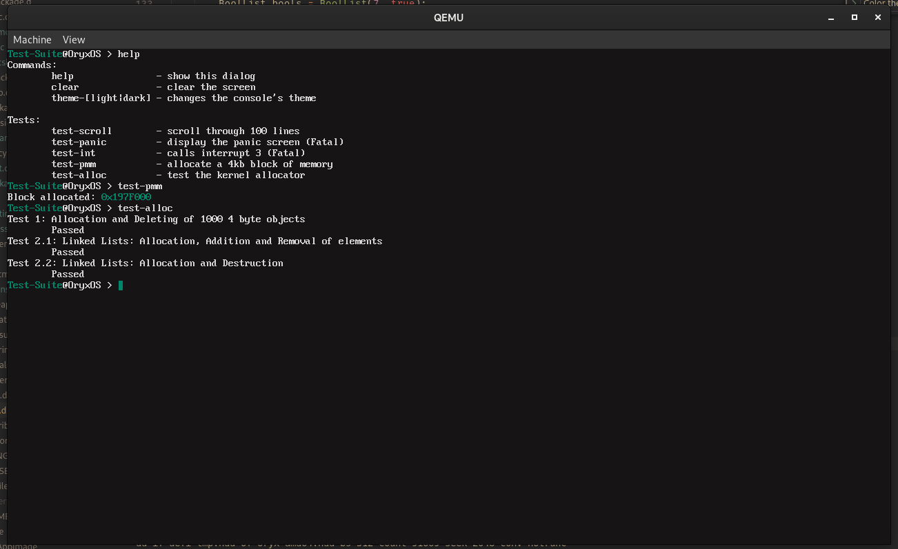

## What is OryxOS?
OryxOS is a non-unix, microkernel-based operating system written in D. OryxOS aims to be fast and to provide a clean and modern API.

## Features

- [x] Core Amd64 structures
- [x] Physical Memory Management
- [x] Virtual Memory Management
- [x] Allocator (200 000 000 allocations/second)
- [x] PS2 Keyboard driver
- [x] Co-operative sheduling

## Screenshot

## Building a distribution of OryxOS

Before building OryxOS, you need to setup the correct build environment.

### Required packages

​	``make``	``parted``	``ld.lld``
​	``mtools``	``qemu``	``ldc``	``nasm`` ``7z``

### Instructions

1. Clone this repository.
3. Enter the folder and run ``./setup.sh``
4. Once the setup has complete, run ``cd ../`` and then run either ``make run-kvm`` to run qemu with kvm or ``make run-tcg`` to just use qemu (``make`` uses kvm by default)
5. If everything has worked, ``qemu`` should open and you should see OryxOS.

### Notes

1. The file ``oryx-amd64.hdd`` is the final OS image and can be burnt to a USB flash drive

## Contributing

Contributions of any sort are welcome. There is a discord where you can talk to the developers and hang out with the community: https://discord.gg/WjgYK9tMPQ